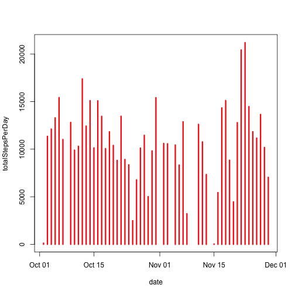
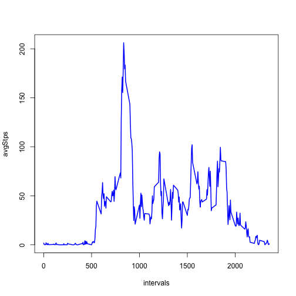
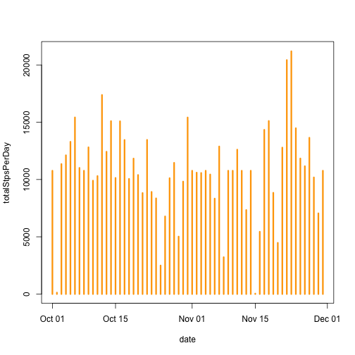
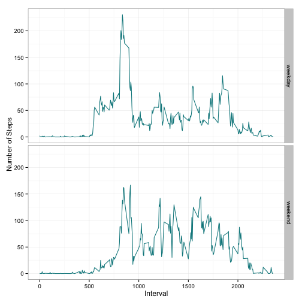

# Personal Activity Monitoring Data Peer Assignment 1
=====================================================

Download the data from the website and Unzip the data
-----------------------------------------------------
Loading the data from the file "activity.csv" to dataset called "activityData"
-----------------------------------------------------------------------------

```r
fileUrl <- "https://d396qusza40orc.cloudfront.net/repdata%2Fdata%2Factivity.zip"
download.file(fileUrl,destfile="activity_Monitoring_Data.zip",method="curl")
unzip("activity_Monitoring_Data.zip")
activityData <- read.csv("activity.csv",header=TRUE,sep=",")
```

Date variable is converted from a factor to Date class

Missing values in the dataset are removed and the dataset created here is called "completeData"


```r
activityData$date <- as.Date(activityData$date)
completeData <- na.omit(activityData)
```
Plot a histogram of the total number of steps taken each day using the "completeData" dataset 
---------------------------------------------------------------------------------------------

```r
totalStepsPerDay <- tapply(completeData$steps,completeData$date,sum)
date <- unique(completeData$date)
plot(date,totalStepsPerDay,type="h",col= "red",lwd =3)
```

 

Calculate and report the mean and median total number of steps taken per day
-----------------------------------------------------------------------------


```r
meanStepsPerDay <- tapply(completeData$steps,completeData$date,mean)
medianStepsPerDay <- tapply(completeData$steps,completeData$date,median)

date <- unique(completeData$date)
meanStepsDf  <- as.data.frame(meanStepsPerDay)
meanStepsDf <- cbind(date,meanStepsDf,medianStepsPerDay)

print(meanStepsDf,row.names=FALSE)
```

```
##        date meanStepsPerDay medianStepsPerDay
##  2012-10-02          0.4375                 0
##  2012-10-03         39.4167                 0
##  2012-10-04         42.0694                 0
##  2012-10-05         46.1597                 0
##  2012-10-06         53.5417                 0
##  2012-10-07         38.2465                 0
##  2012-10-09         44.4826                 0
##  2012-10-10         34.3750                 0
##  2012-10-11         35.7778                 0
##  2012-10-12         60.3542                 0
##  2012-10-13         43.1458                 0
##  2012-10-14         52.4236                 0
##  2012-10-15         35.2049                 0
##  2012-10-16         52.3750                 0
##  2012-10-17         46.7083                 0
##  2012-10-18         34.9167                 0
##  2012-10-19         41.0729                 0
##  2012-10-20         36.0938                 0
##  2012-10-21         30.6285                 0
##  2012-10-22         46.7361                 0
##  2012-10-23         30.9653                 0
##  2012-10-24         29.0104                 0
##  2012-10-25          8.6528                 0
##  2012-10-26         23.5347                 0
##  2012-10-27         35.1354                 0
##  2012-10-28         39.7847                 0
##  2012-10-29         17.4236                 0
##  2012-10-30         34.0938                 0
##  2012-10-31         53.5208                 0
##  2012-11-02         36.8056                 0
##  2012-11-03         36.7049                 0
##  2012-11-05         36.2465                 0
##  2012-11-06         28.9375                 0
##  2012-11-07         44.7326                 0
##  2012-11-08         11.1771                 0
##  2012-11-11         43.7778                 0
##  2012-11-12         37.3785                 0
##  2012-11-13         25.4722                 0
##  2012-11-15          0.1424                 0
##  2012-11-16         18.8924                 0
##  2012-11-17         49.7882                 0
##  2012-11-18         52.4653                 0
##  2012-11-19         30.6979                 0
##  2012-11-20         15.5278                 0
##  2012-11-21         44.3993                 0
##  2012-11-22         70.9271                 0
##  2012-11-23         73.5903                 0
##  2012-11-24         50.2708                 0
##  2012-11-25         41.0903                 0
##  2012-11-26         38.7569                 0
##  2012-11-27         47.3819                 0
##  2012-11-28         35.3576                 0
##  2012-11-29         24.4688                 0
```
What is the average daily activity pattern?
-------------------------------------------

```r
avgStps <- tapply(completeData$steps,completeData$interval,mean)
intervals <- unique(completeData$interval)
plot(intervals,avgStps,type="l",col="blue",lwd=2)
```

 

```r
maxStepsInterval <- names(avgStps[which.max(avgStps)])
print(paste0("The 5 minute interval containing the maximum number of steps is ",maxStepsInterval))
```

```
## [1] "The 5 minute interval containing the maximum number of steps is 835"
```

Calculate and report the total number of missing values in the dataset 
----------------------------------------------------------------------

```r
totalMissingValues <- sum(is.na(activityData))
print(paste0("The total number of missing values in the Dataset is ",totalMissingValues))
```

```
## [1] "The total number of missing values in the Dataset is 2304"
```

Imputing the missing values
----------------------------
Calculating the mean values for all the 5-minute interval
----------------------------------------------------------

```r
meanIntStps <- tapply(completeData$steps,completeData$interval,mean)
meanIntStpsDf <- as.data.frame(meanIntStps)
imputedDf <- activityData
intervals <- unique(imputedDf$interval)
meanIntStpsDf <- cbind(intervals,meanIntStpsDf)
```
Strategy used for Imputing Values
----------------------------------
Replacing the missing values with the above calculated mean for every 5-minute interval
A new dataset "imputedDf" that is equal to the original dataset "activityData"
but with the missing data filled in is created. 


```r
for(i in seq_len(nrow(imputedDf))){
        
        if(is.na(imputedDf$steps[i])){
                
                val <- imputedDf$interval[i]
                imputeVal <- meanIntStpsDf[meanIntStpsDf$intervals==val,]
                imputedDf$steps[i] <- imputeVal[,2]
                
        }
        
}
```
Make a histogram of the total number of steps taken each day from the new dataset "imputedDf"
--------------------------------------------------------------------------------------------

```r
totalStpsPerDay <- tapply(imputedDf$steps,imputedDf$date,sum)
date <- unique(imputedDf$date)
plot(date,totalStpsPerDay,type="h",col= "orange",lwd =3)
```

 
Calculate and report the mean and median total number of steps taken per day using "imputedDf"
---------------------------------------------------------------------------------------------

```r
newMeanStepsPerDay <- tapply(imputedDf$steps,imputedDf$date,mean)
newMedianStepsPerDay <- tapply(imputedDf$steps,imputedDf$date,median)

date <- unique(imputedDf$date)
newMeanStepsDf  <- as.data.frame(newMeanStepsPerDay)
newMeanStepsDf <- cbind(date,newMeanStepsDf,newMedianStepsPerDay)

print(newMeanStepsDf,row.names=FALSE)
```

```
##        date newMeanStepsPerDay newMedianStepsPerDay
##  2012-10-01            37.3826                34.11
##  2012-10-02             0.4375                 0.00
##  2012-10-03            39.4167                 0.00
##  2012-10-04            42.0694                 0.00
##  2012-10-05            46.1597                 0.00
##  2012-10-06            53.5417                 0.00
##  2012-10-07            38.2465                 0.00
##  2012-10-08            37.3826                34.11
##  2012-10-09            44.4826                 0.00
##  2012-10-10            34.3750                 0.00
##  2012-10-11            35.7778                 0.00
##  2012-10-12            60.3542                 0.00
##  2012-10-13            43.1458                 0.00
##  2012-10-14            52.4236                 0.00
##  2012-10-15            35.2049                 0.00
##  2012-10-16            52.3750                 0.00
##  2012-10-17            46.7083                 0.00
##  2012-10-18            34.9167                 0.00
##  2012-10-19            41.0729                 0.00
##  2012-10-20            36.0938                 0.00
##  2012-10-21            30.6285                 0.00
##  2012-10-22            46.7361                 0.00
##  2012-10-23            30.9653                 0.00
##  2012-10-24            29.0104                 0.00
##  2012-10-25             8.6528                 0.00
##  2012-10-26            23.5347                 0.00
##  2012-10-27            35.1354                 0.00
##  2012-10-28            39.7847                 0.00
##  2012-10-29            17.4236                 0.00
##  2012-10-30            34.0938                 0.00
##  2012-10-31            53.5208                 0.00
##  2012-11-01            37.3826                34.11
##  2012-11-02            36.8056                 0.00
##  2012-11-03            36.7049                 0.00
##  2012-11-04            37.3826                34.11
##  2012-11-05            36.2465                 0.00
##  2012-11-06            28.9375                 0.00
##  2012-11-07            44.7326                 0.00
##  2012-11-08            11.1771                 0.00
##  2012-11-09            37.3826                34.11
##  2012-11-10            37.3826                34.11
##  2012-11-11            43.7778                 0.00
##  2012-11-12            37.3785                 0.00
##  2012-11-13            25.4722                 0.00
##  2012-11-14            37.3826                34.11
##  2012-11-15             0.1424                 0.00
##  2012-11-16            18.8924                 0.00
##  2012-11-17            49.7882                 0.00
##  2012-11-18            52.4653                 0.00
##  2012-11-19            30.6979                 0.00
##  2012-11-20            15.5278                 0.00
##  2012-11-21            44.3993                 0.00
##  2012-11-22            70.9271                 0.00
##  2012-11-23            73.5903                 0.00
##  2012-11-24            50.2708                 0.00
##  2012-11-25            41.0903                 0.00
##  2012-11-26            38.7569                 0.00
##  2012-11-27            47.3819                 0.00
##  2012-11-28            35.3576                 0.00
##  2012-11-29            24.4688                 0.00
##  2012-11-30            37.3826                34.11
```
Do these values differ from the estimates from the first part of the assignment? 
--------------------------------------------------------------------------------
After ignoring the missing values there were 8 dates missing from the dataset.The complete dataset now had only 53 dates out of the 61 dates . When the missing values are plugged in, there is no longer any missing days in the dataset. All 61 days are plotted in the histogram.The per day mean and per day median values for the 53 days remain intact as calculated earlier.The per day mean and per day median for the 8 days are calculated with the imputed dataset.

What is the impact of imputing missing data on the estimates of the total daily number of steps?
-----------------------------------------------------------------------------------------------

```r
# using complete dataset with no missing values
totalDailySteps  <- sum(totalStepsPerDay)

# using the imputed dataset after replacing the missing values
totalImputedDailySteps  <- sum(totalStpsPerDay)

print(paste0("The total daily number of steps Before imputing values are ",totalDailySteps))
```

```
## [1] "The total daily number of steps Before imputing values are 570608"
```

```r
print(paste0("The total daily number of steps After imputing values are ",totalImputedDailySteps))
```

```
## [1] "The total daily number of steps After imputing values are 656737.509433962"
```
There is an impact on the total of daily number of steps after imputing the missing values . The total increases from 570608 to 656737 . 

Are there differences in activity patterns between weekdays and weekends?
-------------------------------------------------------------------------

```r
imputedDf$day <- weekdays(imputedDf$date)
for(i in seq_len(nrow(imputedDf))){
        
        if(imputedDf$day[i]=="Saturday" | imputedDf$day[i]== "Sunday"){
                imputedDf$day[i] <- "weekend"
                }else{
                        imputedDf$day[i] <- "weekday"
                }
}
```
Make a panel plot containing a time series plot of the 5-minute interval (x-axis) &
------------------------------------------------------------------------------------
the average number of steps taken, averaged across all weekday days or weekend days (y-axis)
--------------------------------------------------------------------------------------------

```r
wkDayData <- subset(imputedDf,day=="weekday")
wkDayMeanStps <- tapply(wkDayData$steps,wkDayData$interval,mean)

wkEndData <- subset(imputedDf,day=="weekend")
wkEndMeanStps <- tapply(wkEndData$steps,wkEndData$interval,mean)

intervals <- unique(imputedDf$interval)
day <- unique(wkDayData$day)
wkDayDf  <- as.data.frame(wkDayMeanStps)
wkDayDf <- cbind(intervals,wkDayDf,day)
colnames(wkDayDf)[2] <- "meanValue"

end <- unique(wkEndData$day)
wkEndDf  <- as.data.frame(wkEndMeanStps)
wkEndDf <- cbind(intervals,wkEndDf,end)
colnames(wkEndDf)[2] <- "meanValue"
colnames(wkEndDf)[3] <- "day"

compareDf <- rbind(wkDayDf,wkEndDf)

library(ggplot2)
g <- ggplot(compareDf,aes(x=intervals,y=meanValue))
g + geom_line(color="turquoise4")+ facet_grid(day~.)+labs(x="Interval")+labs(y="Number of Steps")+theme_bw()
```

 

